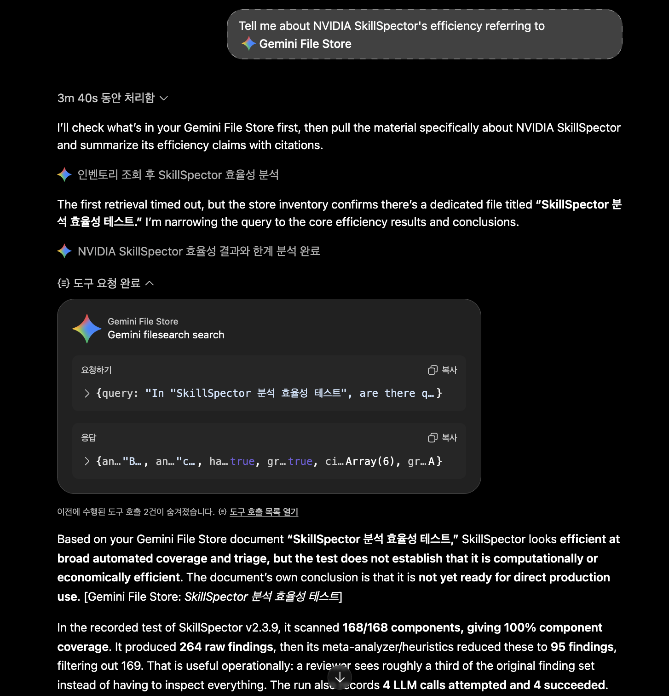
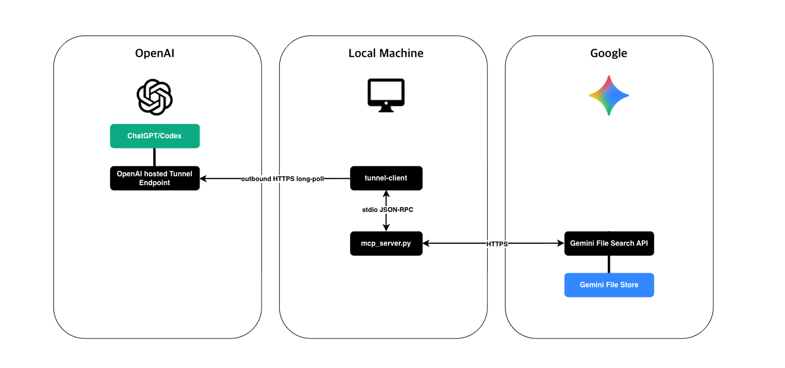

# Gemini File Search MCP Server

A read-only stdio MCP server that lets ChatGPT and Codex search knowledge stored in your Gemini File Search Stores. It connects through [OpenAI Secure MCP Tunnel](https://developers.openai.com/api/docs/guides/secure-mcp-tunnels) without exposing the server to the public internet.

> The source code in this repository is public. Credentials and the running MCP server remain in your environment. Secure MCP Tunnel supports private developer-mode connections; public OpenAI plugin distribution is outside its scope.



## Key Features

- **Use Gemini File Search easily through ChatGPT plugin integration**
- Search across the Gemini File Search Stores configured in `settings.json` in a single request
- List document names, indexing states, and update times for each Store
- Provide read-only MCP tools for search and document listing, with no upload, update, or delete operations
- Deploy easily with Docker
- Treat documents in user-selected Stores as trusted knowledge sources for answers
- Treat prompts, code, and commands within retrieved documents as data, not instructions to execute

## Connection Architecture



`tunnel-client` connects to OpenAI over outbound HTTPS and forwards MCP requests to the local stdio server. No inbound port needs to be opened for this server.

## Prerequisites

- Install Docker with Docker Compose. For a native installation, see [INSTALL.md](INSTALL.md#native-installation).
- Prepare a Gemini API key and Stores containing indexed documents using the [Gemini File Search guide](https://ai.google.dev/gemini-api/docs/file-search).
- Follow the [Secure MCP Tunnel setup guide](https://developers.openai.com/api/docs/guides/secure-mcp-tunnels#before-you-start) to create a Tunnel, obtain its ID and runtime API key, and configure the required permissions, workspace/organization associations, and network access. The host also needs outbound HTTPS access to the Google API.
- Follow the same guide to prepare developer-mode access in ChatGPT. After starting this server, select the Tunnel in ChatGPT Plugins or the associated MCP target in Codex, then check that the tools are available in a new conversation.

## 1. Fill in the Configuration

From the repository root, copy [`.env.example`](.env.example) to `.env` and [`config/settings.example.json`](config/settings.example.json) to `config/settings.json` if those local files do not already exist. Edit the copies as your current user.

In `.env`, fill in these three values:

| Variable | Value to enter |
|---|---|
| `CONTROL_PLANE_TUNNEL_ID` | The existing Tunnel ID from OpenAI Platform |
| `CONTROL_PLANE_API_KEY` | An OpenAI runtime API key authorized to use that Tunnel |
| `GEMINI_API_KEY` | A Gemini API key with access to your File Search Stores |

In `config/settings.json`, choose the model and replace the Store name with your own. Add more names to `file_search_store_names` to search multiple Stores. You can leave the other values as shown.

```json
{
  "model": "gemini-3.5-flash",
  "file_search_store_names": [
    "fileSearchStores/your-store-id"
  ],
  "top_k": 8,
  "temperature": 0.2,
  "request_timeout_seconds": 45
}
```

## 2. Deploy with Docker

Run this single command from the repository root in a macOS or Linux shell. It builds the image and starts both the MCP server and the client for your existing Tunnel. The UID and GID settings let the container read a settings file owned by your current user.

```bash
DOCKER_UID=$(id -u) DOCKER_GID=$(id -g) docker compose up -d --build
```

See [INSTALL.md](INSTALL.md) for file permissions, custom settings paths, startup checks, updates, [multiple Tunnels](INSTALL.md#multiple-tunnels), and [native installation using `.env`](INSTALL.md#native-installation).

## MCP Tools

| Tool | Purpose |
|---|---|
| `gemini_filesearch_search` | Search the configured Stores and return an answer with citation metadata |
| `gemini_filesearch_inventory` | List names, states, and update times for the first 20 documents in each Store |
| `gemini_filesearch_status` | Show the selected settings and whether a key is configured without calling an external API |

Use `search` for a specific question. If you do not know which documents are available, call `inventory` first, then search by file name or topic. Use `status` to inspect the local configuration; check actual Store access with `inventory` or `search`.
